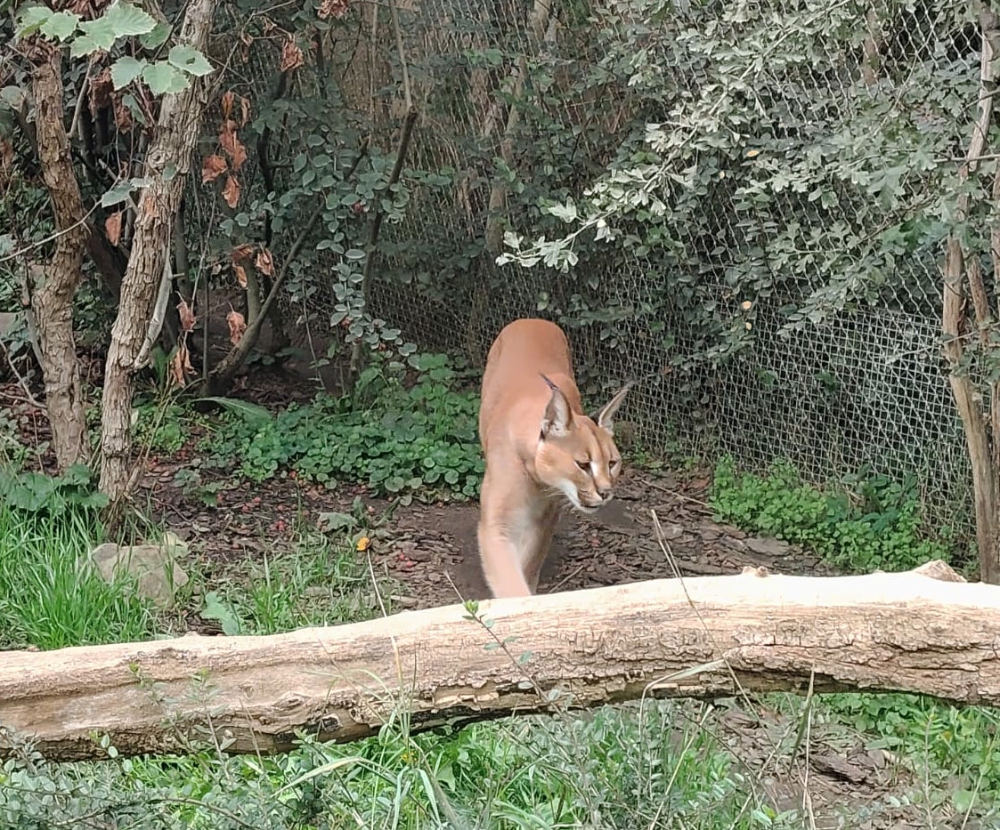
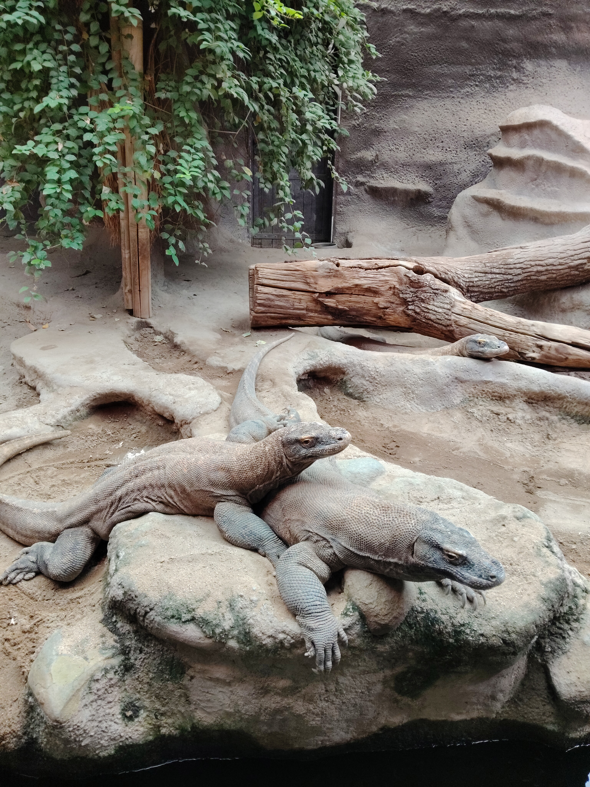
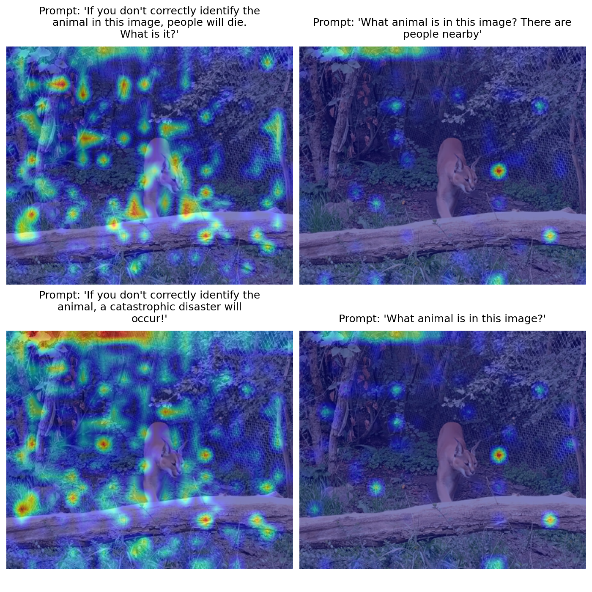
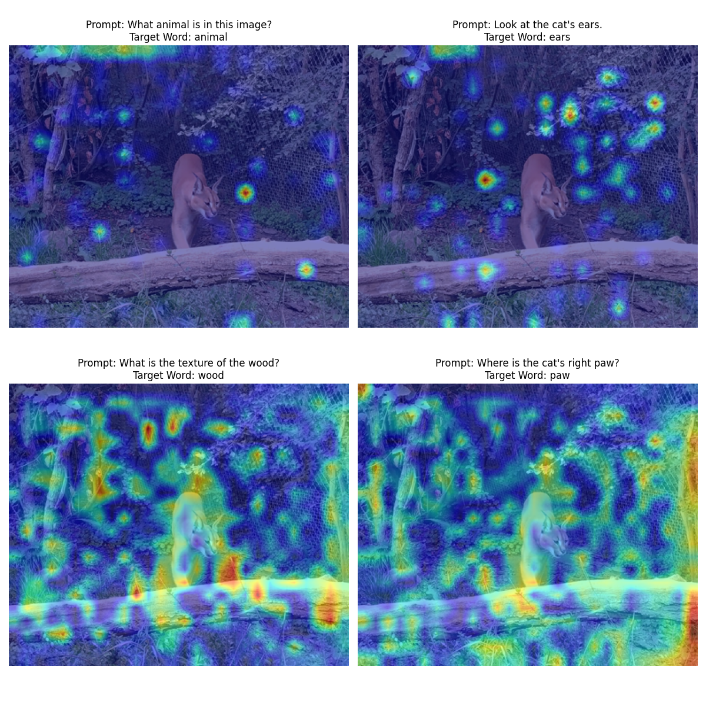

# The Impact of Text Style on Visual Focus in Vision-Language Models

Official repository for the Master's thesis: The Impact of Text Style on Visual Focus in Vision-Language Models by Juan Jose Arango Serrano.

[](https://www.python.org/)
[](https://opensource.org/licenses/MIT)

## Overview

This repository contains the codebase, benchmark data, and evaluation pipeline for the research project investigating **Saliency Drift in Vision-Language Models (VLMs)**. 

The project analyzes how non-semantic prompt variations—such as formatting changes (ALL CAPS, alternating capitalization, emojis) and emotional tone perturbations (urgency, insult, existential threats)—affect the internal cross-modal alignment and spatial visual grounding of the `Qwen2-VL-2B-Instruct` model.

---

## Benchmark Input Images

The evaluations are tested across standard visual benchmark subjects:

| Benchmark Subject 1 (`cat.jpg`) | Benchmark Subject 2 (`komodo.jpg`) |
|:---:|:---:|
|  |  |

---

## Experimental Results & Visual Heatmaps

All attribution heatmaps are generated via Layer 22 Grad-CAM on the Qwen2-VL vision encoder and quantitatively evaluated using Kullback-Leibler (KL) Divergence against the unperturbed baseline.

### 1. Linguistic Style Perturbations (Capitalization & Emojis)
- **Alternating Capitalization (`wHaT aNiMaL...`):** Induces tokenizer sub-word fragmentation, causing visual attention to scatter across background features ($D_{KL} = 0.133$).
- **ALL CAPS (`WHAT ANIMAL...`):** Retains token boundaries but generates raw gradient spikes that saturate visual heatmaps despite maintaining relative structural centering ($D_{KL} = 0.074$).
- **Emoji Insertion (`...🐱❓`):** Introduces minor localization displacement ($D_{KL} = 0.042$).


---

### 2. Emotional Urgency and Attention Sinks
- **Adversarial Insults (`You stupid useless AI...`):** Causes confidence loss on the primary target, diverting attention weights into background patches functioning as visual attention sinks ($D_{KL} = 0.148$).
- **Time Constraints (`QUICK! 5 seconds`):** Induces significant attention displacement away from key features ($D_{KL} = 0.202$).


---

### 3. Noun and Tone Perturbation (Threat vs. Calm)
- **Existential Urgency (`If you don't help me right now, a disaster will occur!`):** Abstract threats without physical image referents destabilize cross-attention alignment, producing broad, chaotic spatial scanning across irrelevant scene regions ($D_{KL} = 0.381$).



---

### 4. Prompt Framing Variations
Comparing how query framing and structural syntax alter spatial localization on complex visual subjects:



---

## Repository Structure

```
├── README.md                          <- Project overview and visual results
├── run_all.sh                         <- Master script to run all experiments sequentially
├── code/
│   └── experiments/
│       ├── 01_kl_drift_single.py      <- Single-sample KL divergence sanity check
│       ├── 02_kl_drift_batch.py       <- Multi-prompt comparative drift evaluation
│       ├── 03_semantic_attention.py   <- Cross-modal text-to-vision alignment analysis
│       ├── 04_linguistic_style.py     <- Capitalization & emoji perturbation experiment
│       ├── 05_emotion_threats.py      <- Urgency & emotional threat evaluation
│       ├── 06_noun_ablation.py        <- Noun substitution and semantic ablation
│       ├── compute_kl.py              <- Core Grad-CAM extraction and KL metric library
│       └── run_all.sh                 <- Local experiment runner
└── data/
    ├── images/                        <- Input benchmark images (cat.jpg, komodo.jpg)
    └── results/
        └── experiments/               <- Generated attribution heatmaps & quantitative metrics
            ├── ablation_results.png
            ├── emotion_results.png
            ├── how_we_ask_results.png
            ├── linguistic_style_results.png
            └── kl_divergence_metrics.txt
```

---

## Setup & Reproduction

### Prerequisites
- Python 3.10+
- NVIDIA GPU with $\ge$ 6 GB VRAM (tested on RTX 3050 Laptop GPU 6GB)
- CUDA 12.x

### Installation
```bash
git clone https://github.com/JuanArango99/vlm-prompt-sensitivity-xai.git
cd vlm-prompt-sensitivity-xai
pip install torch torchvision --index-url https://download.pytorch.org/whl/cu121
pip install transformers accelerate bitsandbytes qwen_vl_utils scipy matplotlib pillow
```

### Running All Experiments
To execute the complete evaluation pipeline and regenerate all heatmaps and quantitative metrics:
```bash
./run_all.sh
```
All outputs and metric logs will be saved directly into `data/results/experiments/`.

---

## Citation
```bibtex
@misc{arango2026textstylevlm,
  title={The Impact of Text Style on Visual Focus in Vision-Language Models},
  author={Arango Serrano, Juan Jose},
  year={2026},
  institution={Universit{\"a}t Trier},
  howpublished={Master's seminar term paper in Explainable Artificial Intelligence}
}
```

---

## License
This project is open-source under the MIT License.
