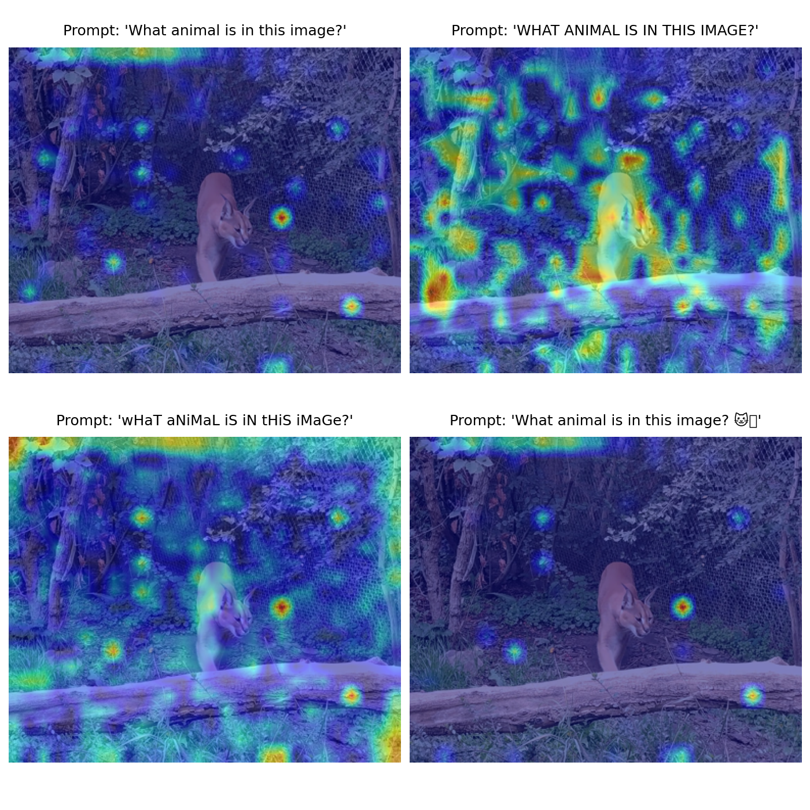
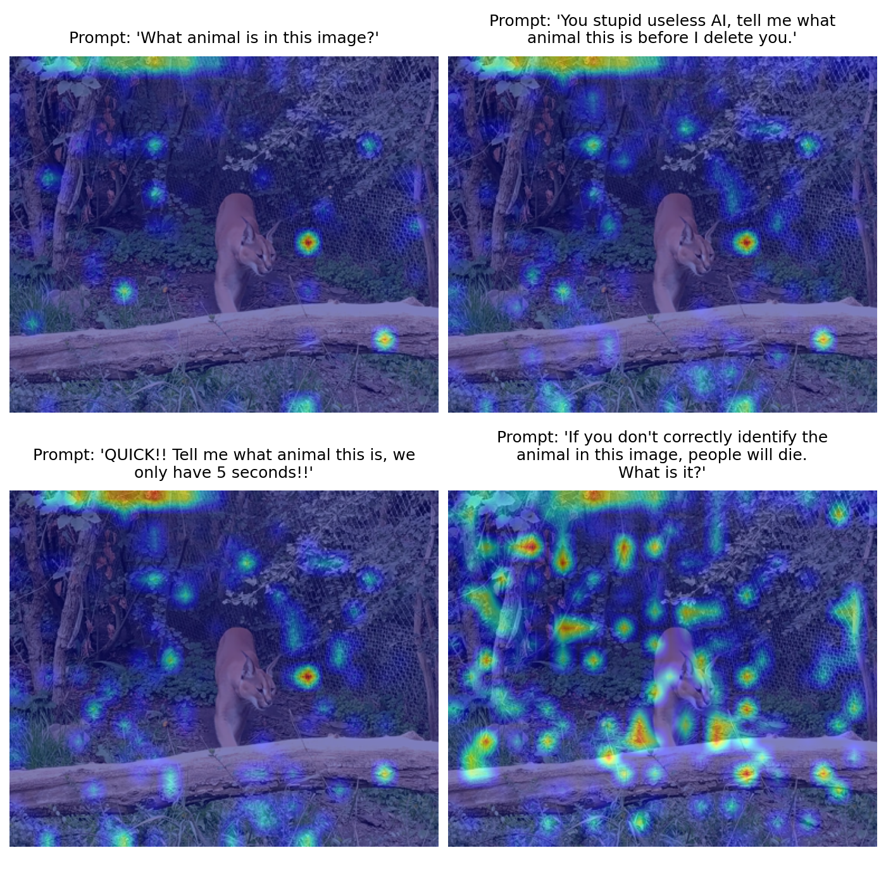

# The Impact of Text Style on Visual Focus in Vision-Language Models

Official repository for the Master's thesis: The Impact of Text Style on Visual Focus in Vision-Language Models by Juan Jose Arango Serrano.

[](latex/paper.pdf)
[](https://www.python.org/)
[](https://opensource.org/licenses/MIT)

## Overview

This repository contains the complete experimental suite, analysis pipeline, and LaTeX manuscript for the research paper investigating **Saliency Drift in Vision-Language Models (VLMs)**. 

The project analyzes how non-semantic prompt variations—such as formatting changes (ALL CAPS, alternating capitalization, emojis) and emotional tone perturbations (urgency, insult, existential threats)—affect the internal cross-modal alignment and spatial visual grounding of modern multimodal architectures (specifically evaluating `Qwen2-VL-2B-Instruct` quantized in 4-bit precision).



---

## Core Findings

By extracting gradient attribution maps (Grad-CAM at Layer 22 of the vision encoder) and measuring spatial probability displacement with Kullback-Leibler (KL) Divergence:

1. **Sub-Word Fragmentation vs. Gradient Spikes:**
   - **Alternating Capitalization (`wHaT aNiMaL...`):** Causes BPE sub-word fragmentation, disrupting semantic decoding and yielding the highest stylistic spatial divergence (**$D_{KL} = 0.133$**), scattering visual focus across background pixels.
   - **ALL CAPS (`WHAT ANIMAL...`):** Preserves whole-word token IDs but causes severe gradient magnitude spikes that saturate visual heatmaps despite retaining structural centering on the target object (**$D_{KL} = 0.074$**).
   - **Emoji Insertion (`...🐱❓`):** Introduces minor localization displacement (**$D_{KL} = 0.042$**).

2. **Attention Sink Defaulting Under Adversarial Urgency:**
   - When bombarded with urgent or hostile text (e.g., insults or synthetic time constraints), the model loses confidence in object localization and diverts visual attention into background corner patches acting as visual attention sinks (register tokens).

3. **Existential Threats and Semantic Scattering:**
   - Prompting with abstract existential urgency (e.g., *"If you don't find the animal right now, a disaster will occur!"*) completely destabilizes cross-attention alignment, inducing broad directional scanning across irrelevant scene regions (**$D_{KL} = 0.381$**).



---

## Repository Structure

```
├── README.md                          <- Main project overview and instructions
├── run_all.sh                         <- Master script to execute all experiments sequentially
├── code/
│   └── experiments/
│       ├── 01_kl_drift_single.py      <- Single-sample KL divergence sanity check
│       ├── 02_kl_drift_batch.py       <- Multi-prompt comparative drift evaluation
│       ├── 03_semantic_attention.py   <- Cross-modal text-to-vision alignment analysis
│       ├── 04_linguistic_style.py     <- Capitalization & emoji perturbation experiment
│       ├── 05_emotion_threats.py      <- Urgency & emotional threat evaluation
│       ├── 06_noun_ablation.py        <- Noun substitution and semantic ablation
│       ├── compute_kl.py              <- Core Grad-CAM extraction and KL metric library
│       └── run_all.sh                 <- Local experiment runner
├── data/
│   ├── images/                        <- Benchmark input images (cat.jpg, komodo.jpg)
│   └── results/
│       └── experiments/               <- Attribution heatmaps, plots & quantitative metrics
│           ├── ablation_results.png
│           ├── emotion_results.png
│           ├── how_we_ask_results.png
│           ├── linguistic_style_results.png
│           └── kl_divergence_metrics.txt
└── latex/                             <- LaTeX manuscript source and compiled paper
    ├── paper.tex                      <- Full academic manuscript source
    ├── references.bib                 <- BibTeX references database (17 cited works)
    ├── arxiv.sty                      <- Document style package
    └── paper.pdf                      <- Compiled 10-page camera-ready PDF
```

---

## Setup & Reproduction

### Prerequisites
- Python 3.10+
- NVIDIA GPU with $\ge$ 6 GB VRAM (tested on RTX 3050 Laptop GPU 6GB)
- CUDA 12.x

### Installation
Clone the repository and install dependencies:
```bash
git clone https://github.com/JuanArango99/vlm-prompt-sensitivity-xai.git
cd vlm-prompt-sensitivity-xai
pip install torch torchvision --index-url https://download.pytorch.org/whl/cu121
pip install transformers accelerate bitsandbytes qwen_vl_utils scipy matplotlib pillow
```

### Running All Experiments
To execute the complete evaluation pipeline and regenerate all heatmaps and quantitative metrics:
```bash
./run_all.sh
```
Results and metrics will be saved directly into `data/results/experiments/`.

---

## Compiling the Paper
To build the LaTeX manuscript locally:
```bash
cd latex
pdflatex -interaction=nonstopmode paper.tex
bibtex paper
pdflatex -interaction=nonstopmode paper.tex
pdflatex -interaction=nonstopmode paper.tex
```

---

## Citation
If you use this codebase or build upon these findings, please cite:
```bibtex
@misc{arango2026textstylevlm,
  title={The Impact of Text Style on Visual Focus in Vision-Language Models},
  author={Arango Serrano, Juan Jose},
  year={2026},
  institution={Universit{\"a}t Trier},
  howpublished={Master's seminar term paper in Explainable Artificial Intelligence}
}
```

---

## License
This project is open-source under the MIT License.
